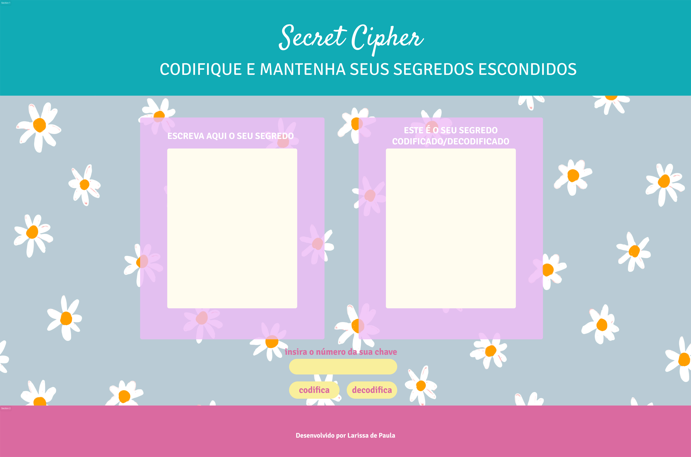
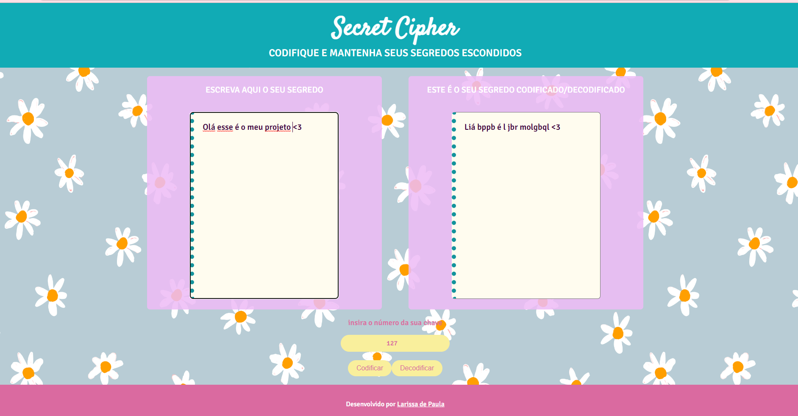

# Cifra de César

## Índice

* [1. Prefácio](#1-prefácio)
* [2. Resumo do projeto](#2-resumo-do-projeto)
* [3. Protótipo](#3-protótipo)
* [4. Usuários e Necessidades do usuário](#4-usuários-e-necessidades-do-usuário)
* [5. Instruções de uso](#5-instruções-de-uso)
* [6. Produto final e Objetivos alcançados](#6-produto-final-e-objetivos-alcançados)
* [7. Acesse o Secret Cipher](https://laridepaula.github.io/SAP010-cipher/)

***

## 1. Prefácio

O projeto em questão é um aplicativo de desenvolvimento web criado como parte 
do bootcamp da Laboratória, que utiliza técnicas de criptografia para cifrar e 
decifrar mensagens. Mais especificamente, o aplicativo utiliza a cifra de César, 
uma das técnicas mais simples de cifragem de mensagens.

A cifra de César é uma cifra por substituição em que cada letra do texto original
é substituída por outra que se encontra a um número fixo de posições (deslocamento) 
mais à frente no mesmo alfabeto. Por exemplo, se o usuário indicar um deslocamento
de 10 posições, a palavra "CODIFICAR" seria cifrada como "MYNSPSMKB".

Para criar o aplicativo, foram utilizadas as linguagens HTML, CSS e JavaScript. 
Ao acessar o aplicativo no navegador, o usuário pode digitar um texto e escolher 
um deslocamento específico de caracteres para cifrar ou decifrar a mensagem. 
Com essa funcionalidade, o aplicativo proporciona uma ferramenta simples e eficaz 
de comunicação segura, permitindo que os usuários enviem mensagens criptografadas 
que só podem ser lidas por aqueles que conhecem o deslocamento utilizado para 
cifrar a mensagem.

Acesse o [Secret Cipher](https://laridepaula.github.io/SAP010-cipher/)

## 2. Resumo do projeto

O [Secret Cipher](https://laridepaula.github.io/SAP010-cipher/) é uma aplicação web que permite a codificação e decodificação
de mensagens secretas, inspirado em diários da época da adolescência e 
revistas teen, com uma temática em tons pastéis, como se estivéssemos voltando 
aos anos 2000.

O usuário pode inserir o texto que deseja codificar ou decodificar e um número 
para ser usado como chave, que determina a quantidade de deslocamento das letras. 
O resultado é exibido em um campo de texto.

### Os objetivos gerais deste projeto são os seguintes

* Trabalhar com base em um boilerplate, a estrutura básica de um projeto em diferentes
  pastas (através de módulos em JS).
* Conhecer as ferramentas de manutenção e melhoria do código (linters e testes
  unitários).
* Aprender sobre objetos, estruturas, métodos e iteração (loops) em JavaScript
* Implementar controle de versão com git (e a plataforma github)

## 3. Protótipo

O layout foi projetado para ser intuitivo e objetivo, com uma tematica que remete os 
diarios da época da adolescencia nos anos 2000, com cores pasteis, e uma paleta 
em tons de azul, amarelo e rosa.

 

## 4. Usuários e Necessidades do usuário

Os principais usuários do Secret Cipher são pessoas que buscam uma solução segura e 
prática para compartilhar mensagens confidenciais, como amigos, familiares e 
colegas de trabalho. Esses usuários podem incluir adolescentes que desejam manter 
segredos de seus pais ou professores, ou adultos que precisam proteger informações 
confidenciais de terceiros não autorizados.

O objetivo desses usuários ao usar o Secret Cipher é garantir a privacidade e a 
segurança das mensagens que compartilham. Eles desejam uma maneira fácil e 
eficiente de codificar e decodificar mensagens secretas, sem correr o risco 
de ter seu conteúdo acessado por outras pessoas. Além disso, eles podem estar 
interessados em manter um certo grau de anonimato em relação ao conteúdo que 
compartilham, garantindo que apenas o destinatário pretendido tenha acesso 
às informações transmitidas.

## 5. Instruções de uso

Para usar o Secret Cipher, basta inserir a mensagem no campo "ESCREVA AQUI O SEU SEGREDO", 
escolher o número da chave de codificação no campo "insira o número da sua chave" e 
selecionar se deseja codificar ou decodificar a mensagem clicando nos botões "Codificar" 
ou "Decodificar". 
A mensagem codificada/decodificada será exibida no campo 
"ESTE É O SEU SEGREDO CODIFICADO/DECODIFICADO".

Lembrando sempre de guardar o número da chave de codificação em segredo, pois só com 
essa informação será possível decodificar a mensagem.

## 6. Produto final e Objetivos alcançados

O projeto "Secret Cipher" trata-se de um site que permite codificar e decodificar 
mensagens, usando a Cifra de César. O usuário insere o texto e o número da chave de 
deslocamento, e o site retorna o texto codificado ou decodificado.

Para definir o produto final em termos de experiência e interface, foram c
onsideradas as referências estéticas da época, como fontes cursivas e cores em tons pasteis, 
para criar uma atmosfera de nostalgia. Foi dada atenção especial à usabilidade, 
para que a ferramenta fosse fácil e intuitiva de usar, com instruções claras 
e campos de entrada e saída bem definidos.

O código fonte consiste em um objeto "cipher" com os métodos "encode" e "decode", 
que realizam a codificação e decodificação da mensagem, respectivamente. 
O site em si é construído usando HTML, CSS e JavaScript. 
O HTML define a estrutura do site, o CSS controla a aparência e o layout e o 
JavaScript manipula o conteúdo dinâmico, como a entrada de texto e a exibição do resultado. 

[✔] Possui uma interface que possibilita criptografar e descriptografar.

[✔] Permite ao usuário escolher o número de deslocamento.

[✔] Aceitação de letras maiúsculas e minusculas.

[✔] Os caracteres especiais são mantidos.

[✔] Testes unitários dos métodos cipher (encode e decode).

